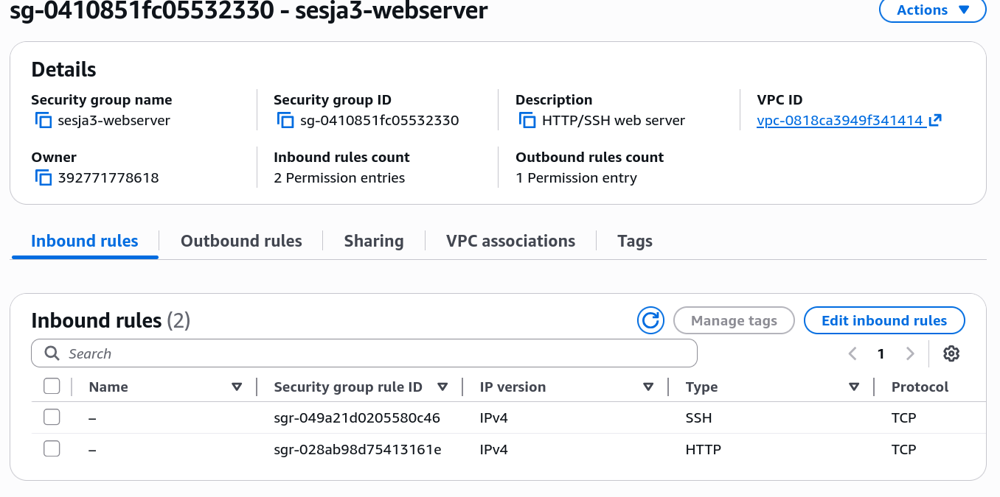
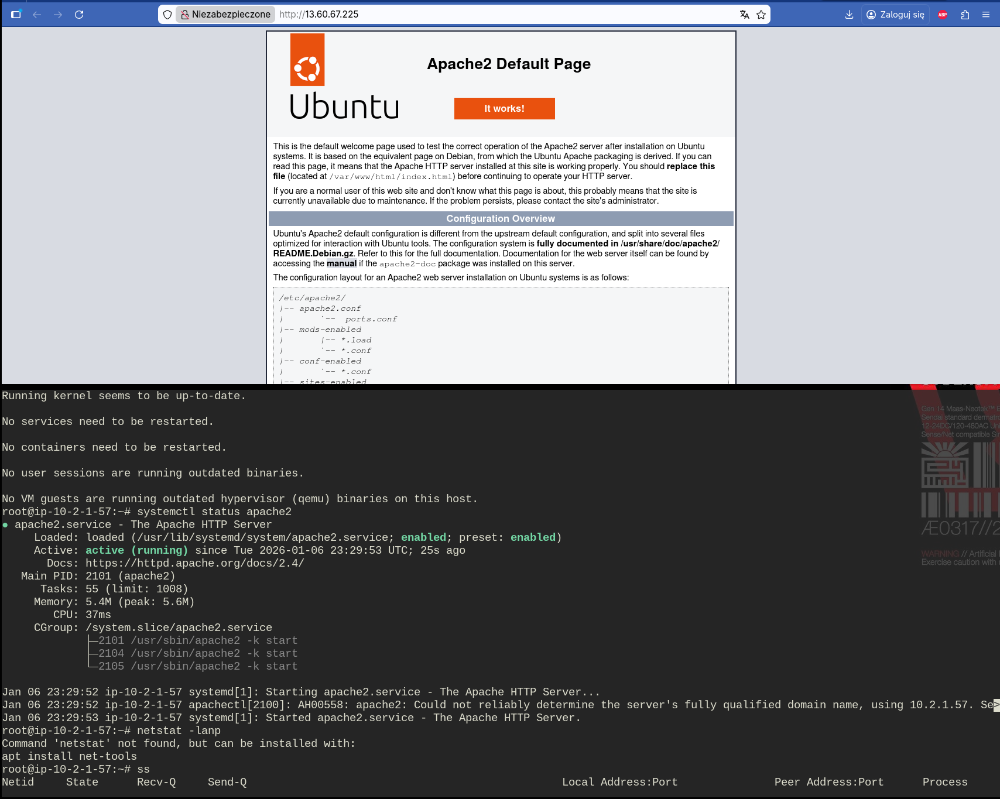
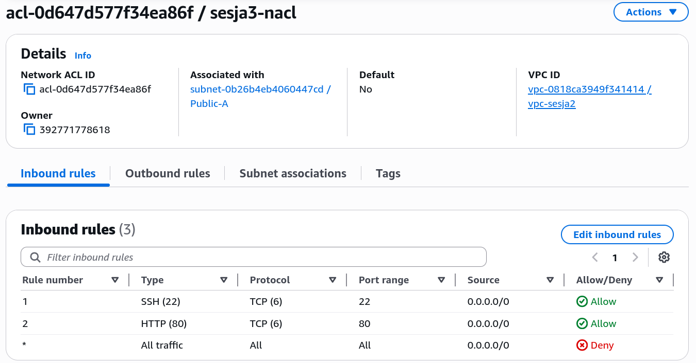
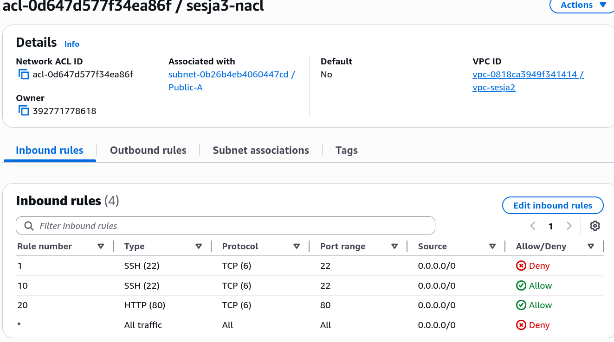
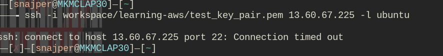

## AWS sesja #3 - network security
### Security groups

 - SSH (22/MyIP) + HTTP (80/Anywhere)
 - Apache2 web server w sesja2-vpc

### NACL
 - Inbound 80/22 TCP

 - Stateless, so outbound rules created separately
 - Lockdown demo, blocking rule with lower number

