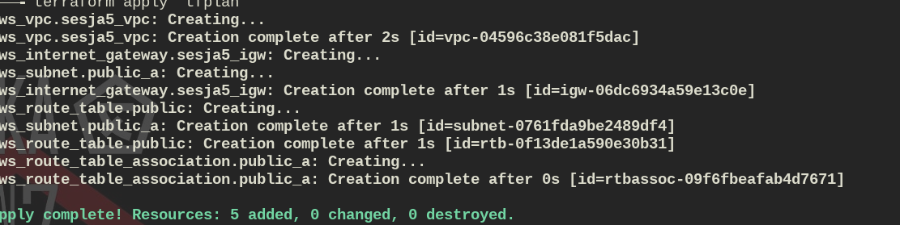
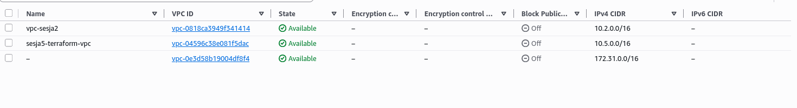

# Sesja 5: Terraform IaC Revolution
## terraform.tfstate = 5 zasobów:
- VPC 10.5.0.0/16 (sesja5-terraform-vpc)
- Public subnet eu-north-1a (10.5.1.0/24)  
- Internet Gateway + Route Table (0.0.0.0/0)
- RT Association

\`\`\`bash
terraform plan -out=tfplan && terraform apply tfplan
\`\`\`

[Screenshot: terraform apply success]

[Screenshot: AWS Console VPC list]

